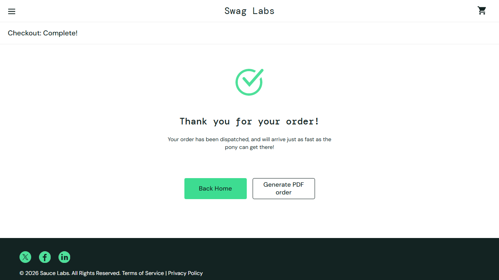
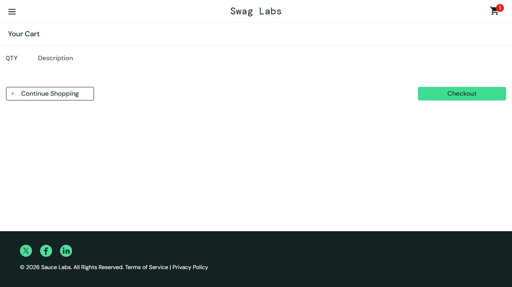
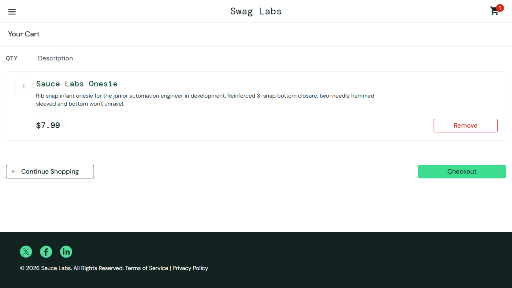
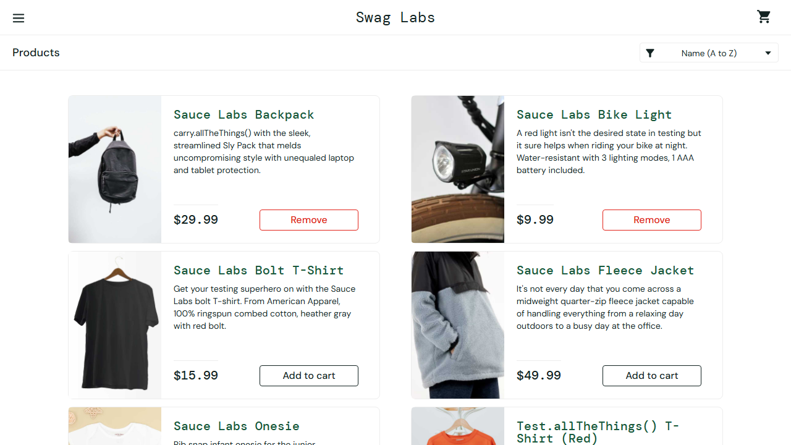

# SauceDemo – Practical QA & AI Assessment

**Application under test:** https://www.saucedemo.com/ · **Account:** `standard_user` / `secret_sauce`
**Test date:** 6 Oct 2026 · Chromium 153 (Playwright 1.63) · Windows 11
**Repository:** https://github.com/ShozabSohail/saucedemo-qa-assessment (runnable test and setup steps in [README.md](README.md))

---

## Contents
1. [Risk-based approach](#1-risk-based-approach)
2. [Task A – AI-assisted exploratory testing (prompt log)](#2-task-a--ai-assisted-exploratory-testing)
3. [Task B – Defect report](#3-task-b--defect-report)
4. [Task C – AI-assisted test automation](#4-task-c--ai-assisted-test-automation)
5. [Task D – AI-driven QA approach (1 page)](#5-task-d--ai-driven-qa-approach)
6. [Tools used](#6-tools-used)

---

## 1. Risk-based approach

SauceDemo is a store, so the costliest failures are the ones that cause a **wrong or broken order**, **expose one shopper's data to another**, or **leave the app in a state the user can't recover from**. I ranked the areas by business impact × likelihood:

| Rank | Area | Why it matters |
|---|---|---|
| 1 | **Checkout and order placement** (cart → info → overview → finish) | This is where revenue comes from. Wrong totals, invalid orders or crashes cost money directly. |
| 2 | **Cart state** (add/remove, badge, persistence, reset) | Cart state is shared across every page. If the badge, the buttons and the cart disagree, users lose trust in the store. |
| 3 | **Session and authentication** (login, logout, direct URLs) | Data exposure; access control |
| 4 | **Catalogue** (sorting, product details) | Product discovery; lower impact |
| 5 | **UX and accessibility** (labels, form validation, messages) | Conversion and inclusivity |

Context that shaped how I classified findings:
- SauceDemo is a **client-side demo app** with no real payment backend. Each test account deliberately carries different bugs (`problem_user`, `error_user`, `visual_user`, …).
- I only report as defects behaviour that `standard_user` hits, which is meant to be the "happy" account.
- Behaviour that follows from the demo's architecture (for example, client-side session handling) is listed under **Observations**, with my reasoning, not as a defect.

---

## 2. Task A – AI-assisted exploratory testing

**How I used AI:** I gave Claude Code (an agentic AI coding assistant in VS Code) the full assessment brief. It broke the work into the phase prompts below (condensed here). It used AI to generate risk hypotheses, then **turned each hypothesis into an executable probe** ([exploration/probe.mjs](exploration/probe.mjs)) that runs against the live site and saves screenshots. Every hypothesis was checked against the real application before I accepted or rejected it. Raw results are in [evidence/probe-results.json](evidence/probe-results.json).

### Prompt 1 – Risk map before testing
> *"You are a senior QA engineer. Here is the SauceDemo assessment brief [pasted] and the app URL. Before writing any test cases, list the highest-risk user journeys for an e-commerce checkout app, ranked by business impact × likelihood. For each, give 2–3 concrete hypotheses of how it could fail that a tester can verify in under 2 minutes. Take into account that this is a demo app where each test user has deliberate bugs."*

- **Purpose:** decide where to spend limited time, and get *falsifiable* hypotheses instead of a generic test-case list.
- **Useful output:** the risk ranking in §1, plus 12 hypotheses (H1–H12), e.g. "checkout allowed with an empty cart", "cart persists after logout", "Reset App State doesn't refresh the UI", "tax/rounding wrong", "auth is client-side only".
- **Accepted / changed / rejected:**
  - **Accepted** the ranking. I moved *session/auth* below *cart state*, because there is no real account data in a demo store.
  - **Rejected** generic suggestions that don't fit this app:
    - password reset and account lockout after N attempts (the app has no such features);
    - payment card validation (the payment step is hard-coded to "SauceCard #31337");
    - SQL injection on login (there's no backend login; credentials are checked client-side).

### Prompt 2 – Turn hypotheses into executable probes
> *"For hypotheses H1–H12, write one Playwright script that tests each against the live site with `standard_user`, logs a compact JSON result for each, and screenshots anything that looks like a defect. Use `data-test` selectors. Use a fresh browser context per hypothesis so state doesn't leak."*

- **Purpose:** check AI claims quickly, with evidence, instead of trusting them.
- **Useful output:** [exploration/probe.mjs](exploration/probe.mjs). One run confirmed or refuted all 12 hypotheses.
- **Validated or refuted by the app:**

| # | AI hypothesis | Result | Decision |
|---|---|---|---|
| H1 | Checkout possible with an empty cart | **Confirmed**: $0.00 order completes | Defect **D1** |
| H2 | Checkout form accepts whitespace-only names | **Confirmed**; postcode `!!@@##` also accepted | Defect **D5** |
| H3 | Reset App State leaves UI out of sync | **Confirmed**: badge clears, buttons still say "Remove" | Defect **D4** |
| H4 | Cart persists across logout / next user | **Confirmed**: next user sees the previous user's cart | Defect **D3** |
| H5 | Authentication can be bypassed by forging the cookie | **Confirmed**; `locked_out_user` stays blocked | Observation (demo architecture) |
| H6 | Sort order lost after visiting a product | **Confirmed**: resets to A→Z | Observation (Low) |
| H7 | Invalid product id is handled gracefully | **Refuted**: leads to a crash | Defect **D2** (found by a follow-up) |
| H8 | Tax/total rounding is wrong | **Refuted**: 95.97 → tax 7.68 (8%), total 103.65 is correct | **Rejected** |
| H9 | Back button after Finish resubmits the order | **Refuted**: shows an empty overview; no duplicate order | Rejected |
| H10 | Login trims whitespace / is case-insensitive | Neither (exact match only) | Rejected (strict matching is acceptable) |
| H11 | Back button after logout shows protected pages | **Refuted**: redirects to login with an error | Rejected |
| H12 | Accessibility gaps | Login inputs have **no `<label>`** (placeholder only); images have alt text; cart link has an aria-label | Observation |

### Prompt 3 – Dig into an unexpected result
> *"The invalid product page (`inventory-item.html?id=999`) shows 'ITEM NOT FOUND' and price `$√-1`, but still has an *Add to cart* button. Investigate what happens downstream: cart page, badge, localStorage, checkout. Capture console errors."*

- **Purpose:** the `$√-1` page is easy to dismiss as a deliberate "easter egg". Instead of stopping at the page, I followed the bad data through the rest of the flow.
- **Useful output:**
  - the phantom id `999` is written to `localStorage` (`[4,999]`);
  - the badge counts it, but the cart page doesn't show it;
  - the checkout overview **crashes to a blank page** with `TypeError: Cannot read properties of undefined (reading 'price')`;
  - the error-reporting call to backtrace.io is blocked by CORS, so the crash is never reported.
- **Corrected:** the AI's first follow-up script assumed the overview would render and waited for `subtotal-label`. It timed out, and that timeout is what exposed the crash. I also had it check how a user recovers. The cart has no Remove button for the phantom item, it survives logout/login, and only the hidden menu option *Reset App State* clears it. → Defect **D2**.

### Prompt 4 – Challenge the severity of each finding
> *"Act as a sceptical product owner. For each confirmed finding, argue why it might be expected behaviour for this specific demo app and this test account. Then give a final severity/priority with a business-impact sentence. Separate true defects from architectural observations."*

- **Purpose:** avoid reporting every oddity as a bug (the brief explicitly warns about this).
- **Useful output / my decisions:**
  - **Forged cookie bypasses login:** reclassified from Critical to *observation*. The app has no server; the `session-username` cookie is the whole session model by design. I note it as Critical for a production system.
  - **Sort reset:** kept as Low UX; not in the top 5.
  - **Cart leaking between users (D3):** the sceptical argument was "a client-only demo has nowhere else to keep the cart". I **kept it as a defect** because logout is a security boundary that users trust on shared devices; the cart could be cleared on logout or stored per user.
  - **Invalid product id (D2):** I raised priority. In a real store this is the "product delisted while in someone's cart" case, which is likely, not just URL tampering.

### Prompt 5 – Evidence quality review
> *"Review each evidence screenshot. Does it clearly show the defect on its own, without misleading artefacts?"*

- **Purpose:** make sure the evidence is honest and stands on its own.
- **Corrected:**
  - The first D3 screenshot logged in as `visual_user` as the second user. That account has *deliberate* layout bugs (the misplaced Checkout button), which would have looked like an extra defect, so I re-took it with `performance_glitch_user`.
  - The first D4 screenshot captured the side menu mid-animation. I re-took it after waiting for the menu to close.

---

## 3. Task B – Defect report

All defects were reproduced with `standard_user` on Chromium 153 and re-run with `npm run explore`. Screenshots are in [evidence/](evidence/).

### D1 – An order can be placed with an empty cart ($0.00 order completes)
| | |
|---|---|
| **Severity / Priority** | **High / P1** |
| **Steps** | 1. Log in as `standard_user`. 2. Without adding any product, click the cart icon. 3. Click **Checkout** (it is enabled). 4. Enter First Name `A`, Last Name `B`, Postal Code `1` → **Continue**. 5. Click **Finish**. |
| **Expected** | Checkout is disabled, or blocked with a message like "Your cart is empty", when the cart has no items. No order can be placed. |
| **Actual** | Overview shows *Item total $0.00, Tax $0.00, Total $0.00*. Finish shows **"Thank you for your order! Your order has been dispatched…"** |
| **Impact** | Creates empty or invalid orders that downstream fulfilment and payment would have to handle. It also gives a misleading confirmation and, in a real system, phantom order records that distort reporting. Very likely to happen: one click from the empty cart. |
| **Evidence** | [D1-empty-cart-overview.png](evidence/D1-empty-cart-overview.png), [D1-empty-cart-order-complete.png](evidence/D1-empty-cart-order-complete.png). Automated guard: `tests/checkout.e2e.spec.ts` → `[known defect D1]` |

### D2 – Checkout crashes to a blank page when the cart contains an unknown product; the cart can't be fixed from the cart page
| | |
|---|---|
| **Severity / Priority** | **High / P2** |
| **Steps** | 1. Log in. 2. Add **Sauce Labs Backpack**. 3. Open `https://www.saucedemo.com/inventory-item.html?id=999`. The page shows "ITEM NOT FOUND", price `$√-1`, and an enabled **Add to cart** button. 4. Click **Add to cart**: the badge shows **2**. 5. Open the cart: only **1** item is listed. 6. Checkout → fill in the form → **Continue**. |
| **Expected** | Unknown products cannot be added. If an unavailable product is in the cart, it is shown as "no longer available" and can be removed, and checkout still renders. |
| **Actual** | Step 6 shows a **completely blank page**. Console: `TypeError: Cannot read properties of undefined (reading 'price')`. The crash report to `submit.backtrace.io` is **blocked by CORS**, so the team is never notified. `localStorage cart-contents = [4,999]` persists across logout/login. The cart page shows no Remove button for the phantom item. Only the menu option *Reset App State* recovers. |
| **Impact** | The customer is completely blocked from purchasing, with no error message and no self-service fix, and the failure is invisible to monitoring. In production this is the "product delisted or out of stock while in someone's cart" case, which is common. Likelihood today is lower, because it needs a stale or invalid product link. |
| **Evidence** | [D2-invalid-product-page.png](evidence/D2-invalid-product-page.png), [D2-badge-cart-mismatch.png](evidence/D2-badge-cart-mismatch.png) (badge 1, cart empty), [D2-checkout-white-screen.png](evidence/D2-checkout-white-screen.png). Reproduce: `node exploration/probe-followup.mjs` |

### D3 – Cart contents survive logout and appear for the next user on the same browser
| | |
|---|---|
| **Severity / Priority** | **Medium-High / P2** |
| **Steps** | 1. Log in as `standard_user`, add **Sauce Labs Onesie**. 2. Menu → **Logout**. 3. Log in as a different user (e.g. `performance_glitch_user`). 4. Open the cart. |
| **Expected** | Logout clears the session, including the cart, or the cart is stored per user. A new user starts with an empty cart. |
| **Actual** | The second user's badge shows **1** and the cart lists **Sauce Labs Onesie**. The cart is stored in `localStorage` (`cart-contents`), which is not tied to a user and is not cleared on logout. |
| **Impact** | Privacy and data-integrity risk on shared or kiosk devices: the next person sees, and could buy, the previous person's items. Users who log out to "reset" are surprised. **Classification note:** I considered whether this is expected behaviour for a client-only demo. I kept it as a defect because logout is the one control users rely on to end their session, and the behaviour breaks that expectation regardless of architecture. |
| **Evidence** | [D3-cart-leaks-between-users.png](evidence/D3-cart-leaks-between-users.png) |

### D4 – "Reset App State" empties the cart but leaves products showing "Remove"
| | |
|---|---|
| **Severity / Priority** | **Medium / P3** |
| **Steps** | 1. Log in, click **Add to cart** on Backpack and Bike Light (the badge shows 2). 2. Menu → **Reset App State** → close the menu. |
| **Expected** | The badge disappears **and** every product button returns to "Add to cart". |
| **Actual** | The badge disappears, but both products still show **Remove**. Clicking a stale "Remove" does nothing visible. The buttons only correct themselves after a page reload. |
| **Impact** | The UI contradicts the cart state. Users may believe items are still in the cart, or need extra clicks to re-add them. It also suggests the component doesn't re-render from shared state, so similar sync bugs may exist elsewhere. Low business cost, high likelihood once the feature is used. |
| **Evidence** | [D4-reset-state-stale-buttons.png](evidence/D4-reset-state-stale-buttons.png) (cart icon has no badge; two buttons read "Remove") |

### D5 – Checkout accepts whitespace-only names and invalid postal codes
| | |
|---|---|
| **Severity / Priority** | **Medium / P3** |
| **Steps** | 1. Log in, add any product, go to checkout. 2. First Name = 3 spaces, Last Name = 3 spaces, Postal Code = `!!@@##`. 3. Click **Continue**. |
| **Expected** | Fields are trimmed and validated: "First Name is required" for whitespace, and an invalid-postcode message. |
| **Actual** | Validation only checks for empty strings, so the user moves on to the overview and can finish the order. Inputs also have no maximum length (5,000 characters accepted). |
| **Impact** | Orders can't be delivered or are hard to match to a customer, which leads to failed shipments and support costs. The existing "required" validation gives a false sense of data quality. |
| **Evidence** | [D5-whitespace-form-input.png](evidence/D5-whitespace-form-input.png), [D5-whitespace-form-accepted.png](evidence/D5-whitespace-form-accepted.png) |

### Observations: investigated, deliberately not reported as top defects
| Finding | Reasoning |
|---|---|
| **Login bypass by setting the cookie** `session-username=standard_user` (not HttpOnly, not Secure) | Confirmed ([evidence](evidence/OBS-forged-cookie-bypass.png)). This is how the client-only demo's session works, not a regression. **In a production app this would be Critical** (server-side session plus HttpOnly/Secure cookies). `locked_out_user` stays blocked even with a forged cookie. |
| Sort order resets to *Name (A→Z)* after viewing a product and clicking Back | Low UX friction; easy workaround |
| Login inputs have no `<label>`; placeholder only | Accessibility gap (WCAG 1.3.1 / 3.3.2) for screen-reader users. Worth a ticket; not top 5 by business impact. |
| Tax and total maths | Checked as **correct** (8% rate, rounded to cents) |
| Behaviour of `problem_user`, `error_user`, `visual_user` | **Excluded**: those accounts have deliberately injected bugs and are out of scope for `standard_user` |

---

## 4. Task C – AI-assisted test automation

**Flow automated:** login → add 2 products → cart → checkout info → overview (totals checked) → finish → confirmation and emptied cart. There is also one negative test and one regression guard for D1.
**Stack:** Playwright Test, TypeScript (strict), page-object pattern. **Run it:** `npm ci && npx playwright install chromium && npm test`. See [README.md](README.md).

**Assertions that matter:** not just "the Thank-you page appears", but:
- the cart badge count;
- the cart and overview contain **exactly** the selected items, in order;
- subtotal = sum of the **listing** prices (catches a price that changes between pages);
- tax = 8% rounded to cents, and total = subtotal + tax, all compared in **integer cents** to avoid floating-point false failures;
- after Finish, the badge is gone (the cart was cleared).

**What AI generated or assisted with:** the page objects, fixtures, test structure, `data-test` selector choice, the `test.fail()` regression-guard idea, the README, and debugging.

**What was wrong, brittle or incomplete in the AI output, and what I changed:**

| Issue | What I did |
|---|---|
| The first draft didn't compile under `strict` TypeScript (`selected` was an implicit `any[]`; Node types weren't configured), yet Playwright still ran it, so nothing visibly failed. | Added `Product[]` typing and `"types": ["node"]`. Added `npm run typecheck` so this is caught in CI. |
| The D1 guard used the default 5 s `expect` timeout on a state that is already settled, wasting about 5 s per run. | Reduced it to 2 s for that single assertion. |
| In the exploration scripts, the AI used `getByTestId()` outside the test runner, where it defaults to `data-testid`, not the site's `data-test`. Result: a misleading 10 s timeout. | Used explicit `[data-test=…]` locators in the standalone scripts. The test suite sets `testIdAttribute: 'data-test'` once in the config. |
| **Are the assertions real?** AI-written assertions can pass trivially. | **Mutation check:** changed the tax rate to 7%. The test failed (`Expected 322, Received 368`), so the totals assertion has teeth. Reverted afterwards. |
| **Flakiness** | Ran `--repeat-each=5` in parallel: **15/15 passed**, no fixed waits. |

**Limitations and risks:**
- The **8% tax rule is inferred from observation**, not from a requirements document. If the business rule changes, the test fails. That's intended, but the rule needs an owner.
- The test logs in through the UI each time. That's fine for one journey; for a larger suite I'd seed the session (cookie/storage state) to cut run time and keep UI login coverage in a single test.
- It runs against a **public third-party site**: network outages or changes to the site cause failures that aren't product regressions. Running it in CI would need a pinned environment.
- Only Chromium is configured. Firefox/WebKit and mobile viewports are a one-line `projects` addition but weren't run.
- Visual layout isn't checked. That would need screenshot comparison (`toHaveScreenshot`) with managed baselines.

---

## 5. Task D – AI-driven QA approach

**Principle:** AI speeds up *generating* tests and analysis; humans own *intent, oracles and release decisions*. When developers generate code and tests with the same AI, the two can share the same misunderstanding of a requirement, so QA's job shifts from writing tests to **independently challenging both**.

**Where AI adds value across the QA lifecycle**
- **Requirements:** turn stories into risks, edge cases and acceptance criteria; flag ambiguity before code is written.
- **Design:** generate exploratory charters and probe scripts (as in Task A); propose boundary and negative data.
- **Automation:** scaffold page objects, locators and test skeletons; refactor; explain failures from traces and logs.
- **Maintenance:** propose fixes when locators break, but **never auto-apply** them to assertions.

**Where human review is mandatory**
- Test oracles: expected results, business rules (e.g. tax), severity and priority.
- Anything touching security, payments, privacy or compliance.
- Deciding whether odd behaviour is a defect or intended (as with D3 and the cookie observation).
- Release go/no-go.

**Review gate before AI tests enter the regression suite**
1. A traceable requirement or risk ID; no orphan tests.
2. **Mutation/negative check:** the test must fail when the behaviour is broken (as with the 7% tax check).
3. Stable selectors (`data-test` or role), no fixed sleeps, isolated state, deterministic data.
4. **Flakiness burn-in:** 10× repeated runs, plus a nightly quarantine lane for new tests.
5. Code review by someone who did not prompt the AI; strict lint and type-check must pass.

**Defect analysis, coverage and regression optimisation**
- AI clusters CI failures by stack trace or error signature, separates product bugs from environment and flaky failures, and drafts bug reports. A human confirms reproduction.
- It maps tests to requirements and changed files to find untested risk; humans decide what is worth covering.
- **Change-based test selection:** run the impacted subset on every PR and the full suite nightly; AI suggests redundant tests to retire, and humans approve.

**CI/CD quality gates**
| Stage | Gate |
|---|---|
| PR | Lint and type-check, unit tests, impacted E2E smoke, an AI review comment (advisory, **non-blocking**) |
| Merge | Full API/E2E regression and coverage change on risky modules; flaky tests quarantined, not retried away |
| Release | Human sign-off on the risk summary; production monitoring and error reporting confirmed working (D2 showed crash reports silently failing) |

**Key risks and mitigations**
| Risk | Mitigation |
|---|---|
| Hallucinated features or wrong oracles (e.g. AI "testing" password reset that doesn't exist) | Every AI test traced to a real requirement; oracles reviewed by a human |
| Tests that always pass (weak assertions) | Mutation checks; assertions on data, not just page loads |
| Same blind spot in code and tests (same model, same prompt) | QA derives tests from the requirements, not from the implementation; exploratory sessions stay human-led |
| Flaky, brittle tests filling the suite | Burn-in, a quarantine lane, a selector policy |
| Data leakage (pasting secrets or PII into prompts) | Approved enterprise AI tools only; masked test data; no production data in prompts |
| Losing skills and over-trusting AI | AI usage logged in PRs; reviewers must explain what they verified |

---

## 6. Tools used

| Tool | Use |
|---|---|
| **Claude Code** (Claude Opus 5.5, VS Code extension) | Risk hypotheses, probe scripts, automation code, debugging, severity challenge, drafting this document |
| **Playwright 1.63** (`@playwright/test`), TypeScript 7 | Exploratory probes, screenshot evidence, E2E automation, HTML report and traces |
| Chromium 153 (Playwright build) | Browser under test |
| Browser DevTools concepts via Playwright (console, localStorage, cookies) | Root-cause evidence for D2, D3 and the cookie observation |
| Node.js 20.16, npm, Git | Runtime, package management, version control |
